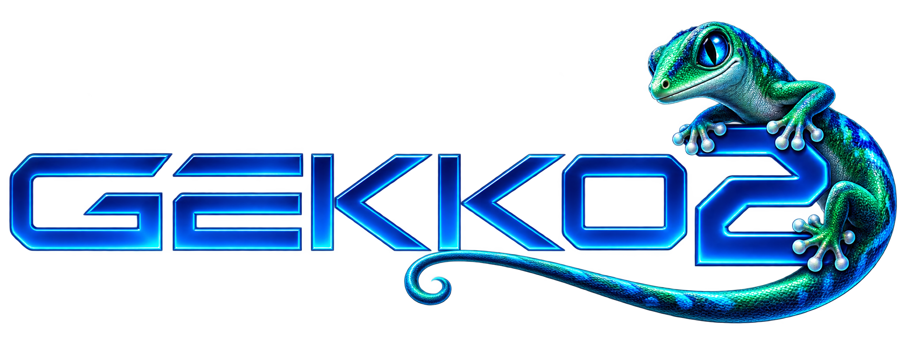
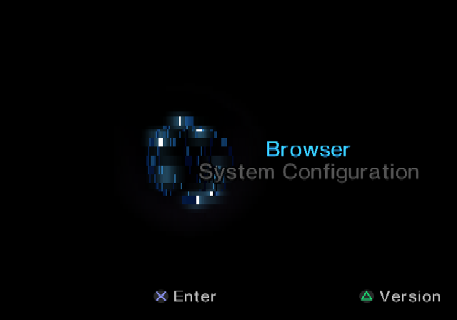
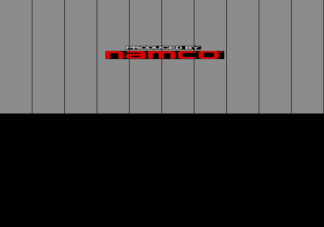
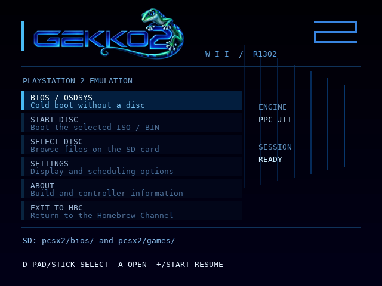

<p align="center"></p>

# Gekko2 for Nintendo Wii

**Experimental PlayStation 2 emulation • Early alpha • Alpha coming soon**

Gekko2 explores PS2 emulation on Nintendo Wii hardware. Alex has spent approximately eight months reading, debugging and testing the project, with assistance from Claude AI and later ChatGPT/GPT-6.1. The original goal was to get the real PS2 BIOS running before attempting games or playable performance.

That work now produces the Sony Computer Entertainment startup screen on a real Wii. The OSDSYS menu renders in the native development build, where entering the Browser and returning to the menu has been tested. Stable, responsive OSDSYS navigation on Wii remains a development goal.

**Current source checkpoint: R1304.** Guarded LB/LBU/LH/LHU/LW/SB/SH/SW operations now join ALU/COP1 instructions in precise EE blocks. Live direct-RAM proof precedes preparation; unsupported data addresses retain scalar fallback. R1303 bookkeeping and R1302 branding are preserved. Read [STATUS.md](STATUS.md) for evidence and limitations, and [the roadmap](docs/ROADMAP.md) for next steps. There is no firm alpha release date, confirmed playable-game list or promised FPS target.

## Why Gekko2?

Previously called PCSX2-Wii, the project now has its own name to reflect its Wii-specific frontend, custom PowerPC recompiler and experimental GX renderer. The gecko mascot nods to Nintendo's PowerPC heritage; the “2” refers to PlayStation 2. Existing `sd:/pcsx2/` data paths remain compatible with older installations.

PCSX2 remains an important source and semantic reference. Gekko2 is an independent homebrew project, not an official PCSX2 release.

## Progress gallery

<p align="center"></p>

*OSDSYS: native development framebuffer capture, not a Wii hardware screenshot.*

<details>
<summary>Tekken Tag Tournament boot progress</summary>



*Historical R1258 native development capture of the Namco startup logo. Subsequent R1297 work fixes the observed retail resource-transfer fault and fractional sprite seams. This image demonstrates boot progress, not a working title screen or gameplay. The owner has also reported reaching the Namco logo on Wii; no playable performance is established.*

</details>

<details>
<summary>Gekko2 launcher preview</summary>



*R1302 host render of the actual launcher drawing routines, not a Wii photograph.*

</details>

## Current features

- R5900 EE and IOP interpretation, guest memory, interrupts, timers, DMA and SIF services.
- Experimental native PPC translation, conservative EE blocks and guarded VU instruction pairs/blocks. EE/IOP/VU coverage and timing remain incomplete.
- Software GS rendering plus one optional **GX (EXPERIMENTAL)** setting for presentation and supported hardware draw paths. Complex states still use software or hybrid handling.
- A Wii launcher with an SD ISO/BIN browser, optional diagnostics and a switchable FPS counter.
- Wii Remote, optional Nunchuk and GameCube controller support; launcher/HBC exit actions.
- SD diagnostics for BIOS startup, JIT counters and GX routing/synchronization.

## Install on SD

Use a build produced from this source. Place the chosen DOL, `meta.xml` and `assets/branding/icon.png` together:

```text
sd:/apps/gekko2/boot.dol
sd:/apps/gekko2/meta.xml
sd:/apps/gekko2/icon.png
```

Place your own BIOS dump in `sd:/pcsx2/bios/`. The loader checks `SCPH50004.bin`, `SCPH39001.bin`, `SCPH10000.bin`, then `bios.bin`. Most verification uses SCPH-50004; other BIOS revisions are not equally verified. Choose **BIOS / OSDSYS** for a disc-free boot.

Optional disc images can go in `sd:/pcsx2/games/`, or be selected elsewhere on SD using the ISO/BIN browser. CHD is not currently supported by the launcher. Disc changes apply on a new boot; resume retains the mounted image.

Configuration may be written to `sd:/pcsx2/bios-config.bin`. Current logs use `Gekko2-R1304-software.log` and `Gekko2-R1304-gx-render.log` in `sd:/pcsx2/`. Launcher settings are session-only. Please identify the build, controller, software/GX setting and BIOS revision when reporting an issue; never attach BIOS, disc images or guest RAM/checkpoints.

## Controls

| Action | Wii Remote / Nunchuk |
| --- | --- |
| Navigate launcher | D-pad / Nunchuk stick |
| Confirm / back | A / B |
| Pause into launcher | HOME |
| Exit to Homebrew Channel | HOME + MINUS, or EXIT TO HBC |
| Toggle FPS in SETTINGS | 2 |
| Toggle diagnostic HUD in SETTINGS | A |
| Toggle update budget in SETTINGS | 1 |
| Toggle GX in SETTINGS | LEFT / RIGHT |
| PS2 Cross / Circle | A / B |
| PS2 Square / Triangle | 1 / 2 |
| PS2 Start / Select | PLUS / MINUS |
| PS2 L1 / R1 | Nunchuk C / Z |

Nunchuk movement currently maps to digital directions, not a complete analog-pad protocol. GameCube controllers are supported; B + Z + START requests HBC exit.

## Build

Install devkitPPC and libogc, then set their paths:

```sh
export DEVKITPRO=/path/to/devkitpro
export DEVKITPPC="$DEVKITPRO/devkitPPC"
export PATH="$DEVKITPPC/bin:$PATH"
sh tools/build_r1304.sh
```

This produces `Gekko2-R1304-Menu-JIT.{elf,dol}` and `Gekko2-R1304-Menu-Interpreter.{elf,dol}`. The validated toolchain is devkitPPC r32 / libogc 1.8.18 with libfat, wiiuse and bte. Other toolchain versions have not been verified for identical behavior. The Makefile supplies an ELF-to-DOL fallback; SDK/compiler distributions are not included.

## Verification

```sh
python3 tools/verify_regressions.py
```

The native suite requires GCC and Python. PPC verification additionally requires Python `unicorn` and, for linked-ELF tools, the built ELF and `powerpc-eabi-nm`:

```sh
python3 tools/verify_ee_memory_blocks_r1304.py Gekko2-R1304-Menu-JIT.elf --nm "$DEVKITPPC/bin/powerpc-eabi-nm"
python3 tools/verify_gs_paths_r1285.py Gekko2-R1304-Menu-JIT.elf --nm "$DEVKITPPC/bin/powerpc-eabi-nm"
```

Host tests cannot execute native PPC directly. Synthetic PPC instruction counts are not Wii cycles or BIOS/game FPS. [STATUS.md](STATUS.md) distinguishes current native/PPC tests, historical artwork checks and owner hardware observations.

## Credits and license

Thank you to the **PCSX2 team and contributors** for their PS2 emulator, code, documentation and research. EE instruction semantics originated from PCSX2 references/ports; attribution and GPL notices remain in the source. The name change does not remove those origins.

- [PCSX2](https://pcsx2.net/) / [source](https://github.com/PCSX2/pcsx2)
- [ps2sdk](https://github.com/ps2dev/ps2sdk): PS2 interfaces and reference documentation.
- [devkitPro](https://devkitpro.org/) and [libogc](https://github.com/devkitPro/libogc): Wii toolchain and platform libraries.
- Bundled ELF-to-DOL/wiiload tools retain their individual licenses. Font attribution is in [docs/licenses/DejaVu.txt](docs/licenses/DejaVu.txt).
- Alex: project development, hardware testing and direction, with Claude AI and ChatGPT/GPT-6.1 assistance.
- Gekko2 logo artwork was created with image-generation assistance; see [branding notes](docs/BRANDING-R1302.md).

The project is **GPL-3.0**; see [COPYING.GPLv3](COPYING.GPLv3). Third-party files retain their own notices and terms. Gekko2 is independent of the credited teams.

BIOS ROMs, game images, private guest RAM/checkpoints, personal runtime logs, BIOS configuration and SDK/compiler binaries are excluded from the public source tree.
